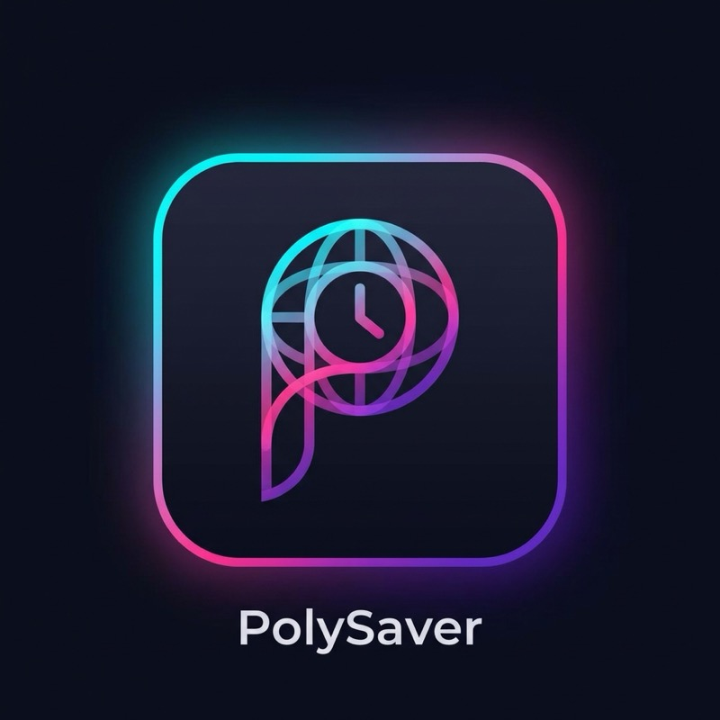
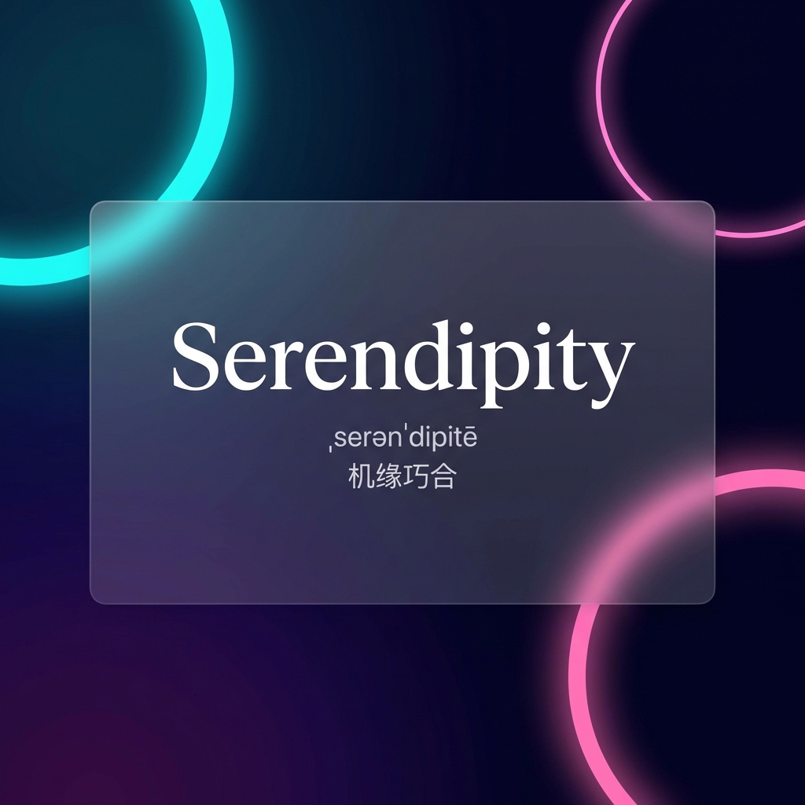

# PolySaver - 多语言学习屏保

<div align="center">



**一款优雅的 macOS 语言学习屏保**

将闲置的屏幕时间转化为高效的语言学习体验，优雅的单词卡片、多API翻译支持、智能缓存系统。


[English](README.md) | [中文](README_zh.md)



</div>

## ✨ 核心特性

- 🎨 **精美界面** - 优雅的单词卡片设计，渐变背景和流畅动画
- 🌍 **多语言支持** - 英语（10+词汇集），计划支持中文、日语、法语、韩语
- 🔄 **智能翻译** - Google、有道、必应翻译API自动降级
- 💾 **智能缓存** - LRU缓存机制 + 磁盘持久化，减少API调用
- 📥 **灵活导入** - 下载精选词汇集或导入自定义单词列表
- 📊 **学习追踪** - 内置统计功能，记录学习进度
- 🎯 **无重复** - 智能算法确保所有单词显示一遍后再循环

## 🚀 快速开始

### 安装步骤

1. 从 [Releases](https://github.com/yourname/PolySaver/releases) 下载最新的 `.saver` 文件
2. 双击安装
3. 前往 **系统偏好设置 → 桌面与屏幕保护程序 → 屏幕保护程序**
4. 从列表中选择 **PolySaver**

### 初次配置

1. 点击 **屏幕保护程序选项**
2. 选择词汇源（例如"英语四级"）
3. 点击 **下载** 并等待完成
4. 点击 **使用** 激活
5. 享受学习吧！🎉

## 📦 支持的词汇集

### 英语
- 四级/六级（CET-4/CET-6）
- 托福/雅思/GRE/GMAT/SAT
- 专业词汇（专四/专八）

### 即将推出
- 🇨🇳 汉语 HSK（汉语水平考试）
- 🇯🇵 日语 JLPT（日本語能力試験）
- 🇫🇷 法语 DELF/DALF
- 🇰🇷 韩语 TOPIK（한국어능력시험）

## 🛠️ 开发者指南

### 系统要求

- macOS 12.0+
- Xcode 14.0+
- Swift 5.9+

### 从源码构建

```bash
git clone https://github.com/yourname/PolySaver.git
cd PolySaver
open PolySaver.xcodeproj
```

按 `⌘B` 构建，然后在 DerivedData 中找到 `.saver` 文件。

### 项目结构

```
PolySaver/
├── Sources/
│   ├── Models/              # 数据模型
│   ├── Services/            # 翻译、下载、缓存服务
│   ├── Managers/            # 业务逻辑管理器
│   ├── Views/               # UI 组件
│   ├── Controllers/         # 窗口控制器
│   ├── Extensions/          # Swift 扩展
│   └── Utilities/           # 工具类
├── Resources/               # 资源文件
├── Tests/                   # 单元测试
└── docs/                    # 文档
```

详见 [架构设计文档](docs/zh/ARCHITECTURE_zh.md)。

### API 集成

PolySaver 支持 **3个翻译服务提供商**，具备自动降级功能：

| 提供商 | 免费额度 | 特色功能 |
|--------|----------|----------|
| **有道翻译** ✅ 推荐 | 100次/天 | 音标、例句 |
| **必应翻译** | 200万字符/月 | 适合批量翻译 |
| **谷歌翻译** | 仅付费 | 翻译质量高 |

配置API：
1. 获取API密钥（[教程](docs/zh/API_INTEGRATION_zh.md)）
2. 打开屏幕保护程序选项
3. 在API设置标签页输入凭据

## 🌟 开发路线图

- [x] 多API翻译 + 智能降级
- [x] LRU缓存系统
- [x] 精美渐变UI
- [ ] **v2.0**: 多语言支持（中文、日语等）
- [ ] **v2.1**: 间隔重复算法（SRS）
- [ ] **v2.2**: 文字转语音（TTS）
- [ ] **v3.0**: iCloud 同步学习进度
- [ ] **v3.1**: 深色模式自动切换

## 📖 文档

- [架构设计](docs/zh/ARCHITECTURE_zh.md)
- [API集成指南](docs/zh/API_INTEGRATION_zh.md)
- [贡献指南](CONTRIBUTING.md)
- [开发环境配置](docs/zh/DEVELOPMENT_zh.md)
- [English Docs](docs/en/)

## 🤝 参与贡献

我们欢迎所有形式的贡献！请在提交 PR 前阅读 [贡献指南](CONTRIBUTING.md)。

### 适合新手的任务

- 🌐 添加新语言支持
- 🎨 设计新主题
- 📝 改进文档
- 🐛 修复问题

查看 [open issues](https://github.com/yourname/PolySaver/issues) 了解当前任务。

## 📄 开源许可

本项目采用 **MIT 许可证** - 详见 [LICENSE](LICENSE) 文件。

## 🙏 致谢

- 词汇数据来源: [kajweb/dict](https://github.com/kajweb/dict)
- 翻译API: Google Cloud Translation、有道智云、Microsoft Azure Translator
- 设计灵感: macOS 内置的每日一词屏保

## 👨‍💻 关于作者

**Kimi** (yshan2028@gmail.com)

我是一名拥有15年经验的测试开发工程师，目前居住在中国上海 🇨🇳。这是我开源的第一个 Apple 屏幕保护程序项目。

**如果你觉得这个项目对你有帮助，请在 GitHub 上点个 ⭐️！** 你的支持是我持续改进项目的动力。

## 📬 联系方式

- **问题反馈**: [GitHub Issues](https://github.com/yshan2028/PolySaver/issues)
- **讨论区**: [GitHub Discussions](https://github.com/yshan2028/PolySaver/discussions)
- **邮箱**: yshan2028@gmail.com

## ⭐ Star 历史

[](https://star-history.com/#yourname/PolySaver&Date)

---

<div align="center">
用 ❤️ 打造 by PolySaver 团队
</div>
