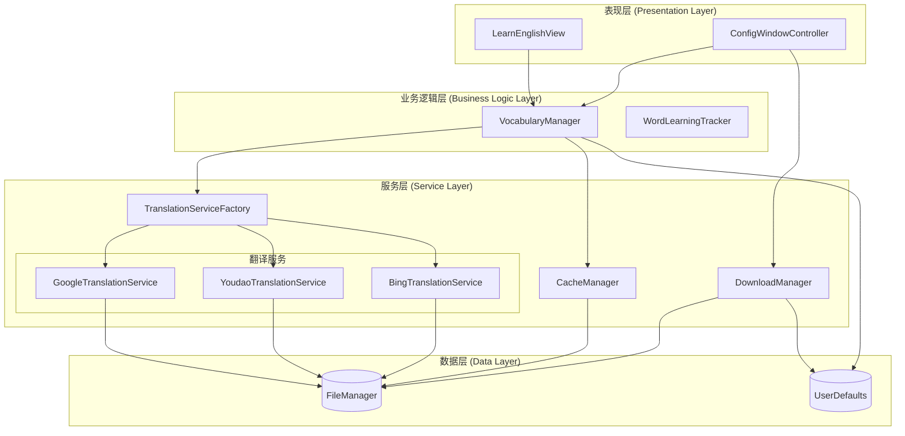

# 架构设计

## 概览

PolySaver 遵循清晰的、面向协议的架构，其灵感来源于 MVVM 和面向服务的设计原则。

## 架构图

## 模块职责

### 表现层
- **LearnEnglishView**: 负责渲染屏保 UI，处理动画，以及展示单词卡片。
- **ConfigWindowController**: 管理设置窗口，处理用户输入以及配置验证。

### 业务逻辑层
- **VocabularyManager**: 核心协调者。管理当前词汇源，追踪显示的单词，并协调从服务层获取数据。它现在还处理会话间的持久化。
- **WordLearningTracker**: 追踪用户的学习进度（已学单词、收藏单词等）。

### 服务层
- **TranslationServiceFactory**: 抽象工厂，根据配置提供具体的翻译服务实例。
- **DownloadManager**: 处理 ZIP 文件的下载、解压和清理。
- **CacheManager**: 实现 LRU (最近最少使用) 缓存策略，用于存储翻译结果，减少 API 调用。

### 数据层
- **FileManager**: 处理本地文件系统的读写操作（词汇文件、缓存）。
- **UserDefaults**: 存储用户配置、API 密钥以及轻量级的状态持久化（如当前显示的单词进度）。
